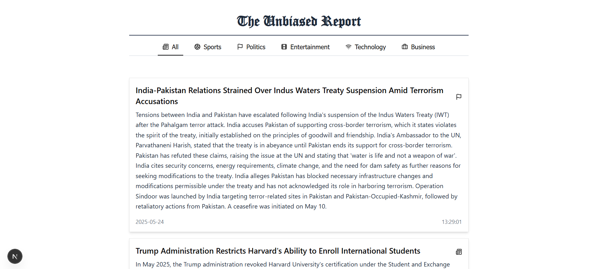
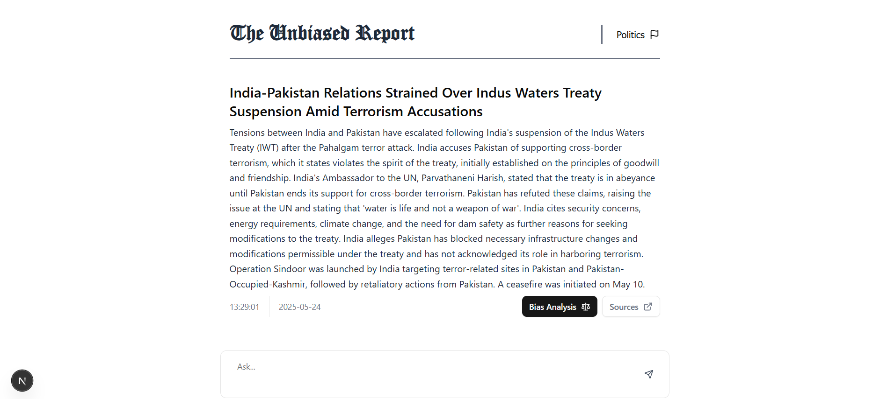
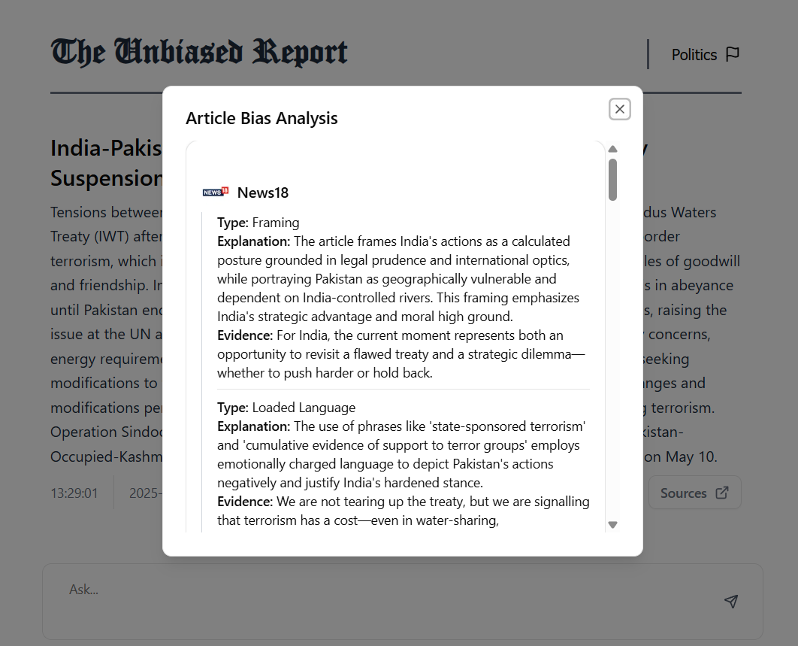
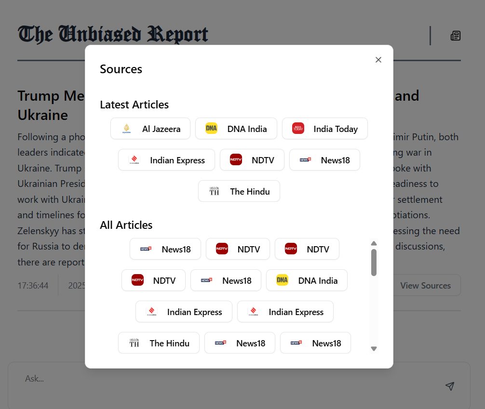

# 📰 The Unbiased Report

An **unbiased news aggregator** powered by LLMs and vector search.  
We collect news from various sources, group similar articles, and generate **neutral summaries** using LLMs.  
Our goal is to fight media bias and help users **stay informed without influence**.

 <!-- Replace with actual image path -->
 <!-- Replace with actual image path -->

---

## 🔍 How It Works

1. **Article Collection**  
   News articles from multiple sources are scraped.

2. **Vectorization & Grouping**  
   Articles are converted to semantic vectors and grouped using vector similarity.

3. **LLM Summarization**  
   Closely related articles are sent to an LLM for unbiased summarization.

4. **Storage & Updates**  
   Summaries and articles are stored in a database. When new related articles arrive, summaries get updated.

5. **Frontend Display**  
   - Lists summaries
   - Allows deep-diving into articles
   - Interactive Q&A and bias reports

---

## 🖼 UI Overview

### 🏠 Homepage

- Displays a list of unbiased summaries.
- Clean, minimal interface.


---

### 📄 Article Page

Two components:

#### 1. 📊 Bias Report & Latest from Source
- Shows a **bias score/report** for the grouped article.
- Lists all **latest articles** from each **unique source**.




#### 2. 💬 Ask a Question
- Users can **ask questions** about the article.
- The system fetches latest related articles as context for **accurate, up-to-date responses**.


---

## 🚀 Running Locally

### Prerequisites
- Node.js ≥ 18
- npm ≥ 9

### Start Frontend & Backend

Both frontend and server are in the same repo.

```bash
npm install
npm run dev
